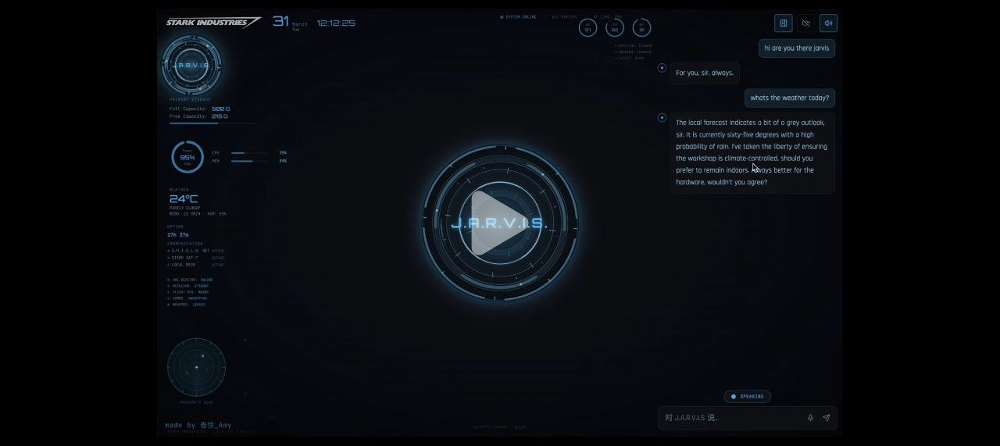

# System AI

A Jarvis/Friday-style local AI desktop assistant powered by Gemma 4 + Ollama.

Transparent HUD interface. Voice conversation. Fully local. No cloud required.

## Features

- **Sci-fi HUD interface** — Transparent frameless window, ArcReactor animation, boot sequence
- **Streaming chat** — Ollama with Gemma 4, real-time text display
- **Voice output (TTS)** — Edge TTS with British Jarvis voice, or Fish Speech for voice cloning
- **Voice input (STT)** — Local Whisper speech recognition, auto-stops on silence
- **Smart interrupt** — Speaking stops AI audio output instantly
- **Always-on mic** — Optional continuous listening mode
- **Settings panel** — Model selector, TTS engine, voice config, silence timeout
- **File operations** — Open, read, save, edit local files via AI
- **System monitor** — CPU, RAM, GPU, weather, uptime, radar display
- **user.md context** — Persistent user profile injected into system prompt

## Screenshot



## Prerequisites

| Dependency | Size | Download |
|------------|------|----------|
| [Node.js](https://nodejs.org/) v18+ | ~70MB | [nodejs.org](https://nodejs.org/) |
| [Python](https://www.python.org/) 3.10+ | ~25MB | [python.org](https://www.python.org/) |
| [Ollama](https://ollama.ai/) | ~200MB | [ollama.ai](https://ollama.ai/) |

**Estimated total download: ~6-9 GB** (including Gemma model)

## Installation

```bash
# 1. Clone the repo
git clone https://github.com/yourname/system-ai.git
cd system-ai

# 2. Install Node.js dependencies
npm install                              # ~300MB, 3-5 min

# 3. Install Python dependencies
pip install edge-tts faster-whisper      # ~100MB, 2-3 min

# 4. Pull the AI model (choose one)
ollama pull gemma4:e4b                   # ~5-8GB, 10-30 min
# or
ollama pull gemma3:4b                    # ~2.5GB, 5-15 min
# or
ollama pull llama3.2:3b                  # ~2GB, 5-10 min

# 5. Make sure Ollama is running
ollama serve

# 6. Start the app
npm run electron:dev
```

The Whisper `tiny` model (~75MB) downloads automatically on first voice input.

## Configuration

### user.md

Edit `user.md` to personalize the AI's knowledge about you:

```markdown
# User Profile
- Name: sir
- Location: Kuala Lumpur, Malaysia
- Language: English (conversational)
- Timezone: Asia/Kuala_Lumpur

## Preferences
- Prefers concise, direct answers
- Likes the Jarvis persona
```

### Settings Panel

Click the gear icon in the bottom bar to configure:

- **Model Provider** — Ollama (local) or OpenAI API
- **Active Model** — Select from installed Ollama models
- **TTS Engine** — Edge TTS (online) or Fish Speech (local, voice cloning)
- **Persona** — J.A.R.V.I.S. (British) or F.R.I.D.A.Y. (American)
- **Voice Rate/Pitch** — Fine-tune the voice
- **Always Listening** — Continuous mic mode
- **Silence Timeout** — Auto-stop after N seconds of silence (default 1.5s)

### Python Path

Python is auto-detected in this order:

1. Environment variable `PYTHON_PATH` or `PYTHON`
2. `python` / `python3` on your system PATH
3. Common install locations per platform

To override, set the env var before launching:

```bash
# Windows (PowerShell)
$env:PYTHON_PATH = "C:\Path\To\python.exe"
npm run electron:dev

# macOS / Linux
PYTHON_PATH=/usr/bin/python3 npm run electron:dev
```

## Architecture

```
Electron Main Process
  ├── main.js                    — Entry, IPC handlers, lifecycle
  ├── preload.js                 — contextBridge IPC bridge
  └── services/
      ├── python.js              — Auto-detect Python executable path
      ├── ollama.js              — Ollama HTTP API
      ├── conversation.js        — Chat history + system prompts
      ├── tts.js                 — Edge TTS wrapper
      ├── tts_server.py          — Edge TTS Python server
      ├── tts_fish_server.py     — Fish Speech TTS server (optional)
      ├── stt.js                 — Whisper STT wrapper
      ├── stt_server.py          — Whisper STT Python server
      └── fileops.js             — File read/write/list operations

React Renderer (Vite)
  ├── stores/chatStore.ts        — Zustand state management
  ├── components/
  │   ├── BootSequence/          — Boot animation + beeps
  │   ├── HUD/                   — HUDLayout, ArcReactor, panels
  │   ├── Chat/                  — Chat panel, streaming text
  │   └── Settings/              — Settings panel
  └── styles/                    — Theme, animations
```

### TTS/STT Dual-Server Pattern

Both TTS and STT use the same architecture:

1. Python server starts on random port, prints `PORT:NNNNN` to stdout
2. Node.js reads port, stores it for HTTP requests
3. On request: Node sends HTTP POST to `localhost:port`
4. Python processes and returns result
5. If Python crashes, Node auto-restarts it

This avoids spawning a new Python process per request (~1s overhead saved).

## Commands

| Command | Description |
|---------|-------------|
| `npm run electron:dev` | Start development (Vite + Electron) |
| `npm run dev` | Vite only (no Electron) |
| `npm run electron:build` | Build production installer |

## Models

Works with any Ollama model. Recommended:

| Model | Size | RAM Needed | Quality |
|-------|------|-----------|---------|
| `gemma4:e4b` | ~5GB | 8GB+ | Good — default |
| `gemma3:4b` | ~2.5GB | 6GB+ | Good |
| `llama3.2:3b` | ~2GB | 4GB+ | Fast |
| `gemma4:26b` | ~16GB | 32GB+ | Best |

## Adding Fish Speech (Voice Cloning)

For Jarvis-quality voice cloning:

```bash
# Install Fish Speech
pip install fish-speech

# Place reference audio clips:
# electron/services/voices/jarvis.wav   — 10-30s of Jarvis dialogue
# electron/services/voices/friday.wav   — 10-30s of Friday dialogue

# Then select "Fish Speech" in Settings → TTS Engine
```

## Keyboard Shortcuts

| Shortcut | Action |
|----------|--------|
| `Alt+J` | Show/hide window |

## Platform Support

| Platform | Status | Notes |
|----------|--------|-------|
| Windows 10/11 | Supported | Primary target |
| macOS (Intel) | Untested | Should work, not tested |
| macOS (Apple Silicon M4) | Planned | 16GB unified memory |
| Linux | Untested | Electron + Python should work |

## Roadmap

- [x] Electron transparent HUD
- [x] Ollama streaming chat
- [x] Edge TTS voice output
- [x] Whisper STT voice input
- [x] Settings panel with model selector
- [x] Voice interrupt (speaking stops AI)
- [x] File operations plugin
- [ ] Fish Speech voice cloning TTS
- [ ] Jarvis/Friday theme toggle (cyan vs orange)
- [ ] Wake word detection ("Hey Jarvis")
- [ ] OpenAI-compatible API provider
- [ ] Plugin system for extensions
- [ ] macOS installer

## License

MIT
